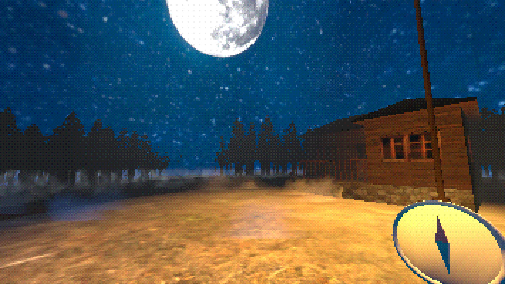
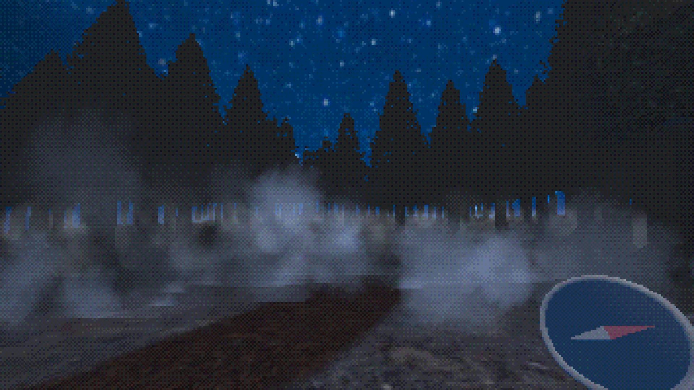

# 🌲 RootedShadow

   

A short stealth game in a dark forest, made with [Godot Engine](https://godotengine.org/), for the Global Game Jam 2023.

## About

You are a lost person, in a dark forest, where you are not welcome. You are looking to get back to your car, but the forest is a real maze. You will have to run, hide and avoid the roots on the ground, because some trees will not like that.

### Controls

- `WASD` or `left stick` to move.
- `Mouse` or `right stick` to move the camera around.
- `Shift` or `Xbox L3` to sprint.
- `Space` or `Xbox Ⓐ` to jump.
- `ESC` to open and close settings menu.

### Screenshots

 

## Contributing

We welcome community contributions to this project.

Please read our [Contributor Guide](CONTRIBUTING.md) for more information on how to get started.
